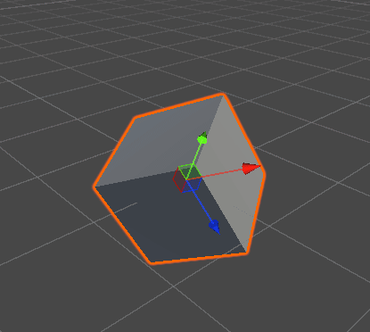
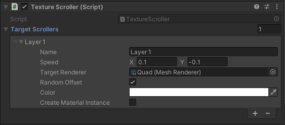

## Animators
### Ping Pong
> _**NOTE** `Rotation` & `Position` target World Space_

This animator will Ping-Pong the follow transform values if enabled:
- Position
- Rotation
- Scale

Set the speed _( > 0)_ & the animator curve. This will target the Transform that it's attached to and will run automatically.
### Simple Spin
This animator will rotate the specified degrees per frame * `Time.deltaTime`. It targets the attached Transforms world
rotation value. Works for both 2D & 3D.

### Texture Scroller
The texture scroller animator allows you to target multiple renderers to apply UV offsets over time. You select the speed
on the X & Y axis.

- `RandomOffset`: If you want to have a texture be offset between 0.0 -> 1.0 enable this
    - This will be applied only if a speed on either the X or Y axis `!= 0.0`
- `CreateMaterialInstance`: If you enable this, a new instance of the target renderer material will be created to prevent
  global setting of the offsets,

### Transform Animator
This animator will provide a shake/wobble effect, generally good if you want something to react to being interacted with.
It will animate for a random amount of time, limited by specified time range. This does not run automatically, and will
need to be called from scripts to trigger. This will target the Transform it's attached to. See below for the functions that can be called.

- `Time Range`: The animator will choose a value between these min & max for how long to animate for
- `ScaleCurve`: This is the value to **multiply the scale by**, so ensure that the value matches expectations!!
- `Rotation Curve`: How the localRotation is applied. `transform.localRotation = Quaternion.Lerp(CCW, CW, scaleCurve.Evaluate(dt) - 0.5f);`

- `void Play()`: This will cause the animation t play a single time. If its already playing, it will call `Stop()` before it starts again.
- `void Loop()`: Operates similar to `Play()`, but will continue until `Stop()` is called.
- `void Stop()`: Resets the Transform to its original Scale & Rotation