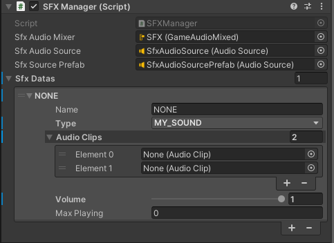
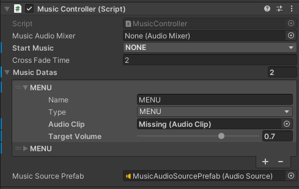
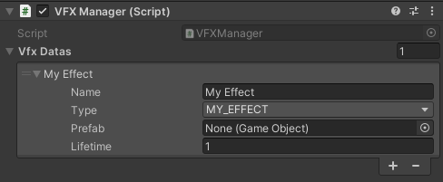

# Jam Starter Kit
This package is meant to include an ever-growing library of scripts, tools, systems & basic textures that help to kick off
projects & Game jams.

### `v0.0.1` - Dec 12, 2024

## Included packages:
- [Unity Feature 2d](https://docs.unity3d.com/6000.0/Documentation/Manual/2DFeature.html)
- [Cinemachine](https://docs.unity3d.com/Packages/com.unity.cinemachine@2.3/manual/CinemachineOverview.html)
- [TextMeshPro](https://docs.unity3d.com/Packages/com.unity.ugui@2.0/manual/TextMeshPro/index.html)
- [New Input System](https://docs.unity3d.com/Packages/com.unity.inputsystem@1.11/manual/index.html)
- [Newtonsoft JSON](https://docs.unity3d.com/Packages/com.unity.nuget.newtonsoft-json@3.2/manual/index.html)
- [Naughty Attributes](https://github.com/dbrizov/NaughtyAttributes)
- [Unity Utils](https://github.com/ayellowpaper/SerializedDictionary)
---
 
## Features

### SFX & Music Managers

> **_NOTE You will want to create a prefab variant of the `Audio Controllers` prefab, to ensure that your changes are maintained!_**

The `AudioControllers` prefab manages both Music & SFX, and should be in the scene if you intend to call it!

#### SFX Manager
The intention of the SFX Manager is to allow you to easily play SFX, that can then be easily called
anywhere within your code, without needing to worry about managing the lifespan SFX, automatically setting sound varieties,
channel limits, as well as volume limits


- You can use `Max Playing` to help prevent spam. When the value is `0` it will play unlimited.
- `AudioClips` list will choose a random sound from the list when called, you can use just a single sound if you like.

You can add new enum values into `SFX.cs`, as this will operate in two locations:

1. The `Audio Controllers` prefab, can then add a new entry
   - ```csharp
      public enum SFX
      {
         NONE = 0,
         MY_SOUND = 1
      }      
2. You can then use that enum value in code to play the sound, optionally at a world location
   - ```csharp
      SFX.MY_SOUND.PlaySound(volume: 1f);
   - ```csharp
     SFX.MY_SOUND.PlaySoundAtLocation(transform.position);
     
#### Music Manager
The intention of the Music Manager is to allow you to easily play Music, that can then be easily called
anywhere within your code, without needing to worry about fading the music, or setting its volume.


- You can use `Cross Fade Time` to apply a global total time to move between music clips

You can add new enum values into `MUSIC.cs`, as this will operate in two locations:

1. The `Audio Controllers` prefab, can then add a new entry
   - ```csharp
      public enum MUSIC
      {
          NONE,
          MENU,
          GAME,
     }
2. You can then use that enum value in code to play the sound, optionally at a world location
   - ```csharp
      MUSIC.MENU.PlayMusic();

### VFX Manager
> **_NOTE You will want to create a prefab variant of the VFX Manager prefab, to ensure that your changes are maintained!_**

The intention of the VFX Manager is to allow you to easily create library of effect prefabs, that can then be easily called
anywhere within your code, without needing to worry about managing the lifespan of that newly created GameObject. This
also avoids needing to find `VFXManager.cs` within the scene, so long as the prefab exists within the scene.



You can add new enum values into `VFX.cs`, as this will operate in two locations:

1. The `VFX MANAGER` prefab, can then add a new entry
   - ```csharp
      public enum VFX
      {
         NONE = 0,
         MY_EFFECT = 1
      }      
2. You can then use that enum value in code to instantiate the prefab 
   - ```csharp
      VFX.MY_EFFECT.PlayAtLocation(transform.position, scale: 1f, keepAlive: false);

> `keepAlive`: This will ignore the specified lifetime set on the `VFX MANAGER` prefab